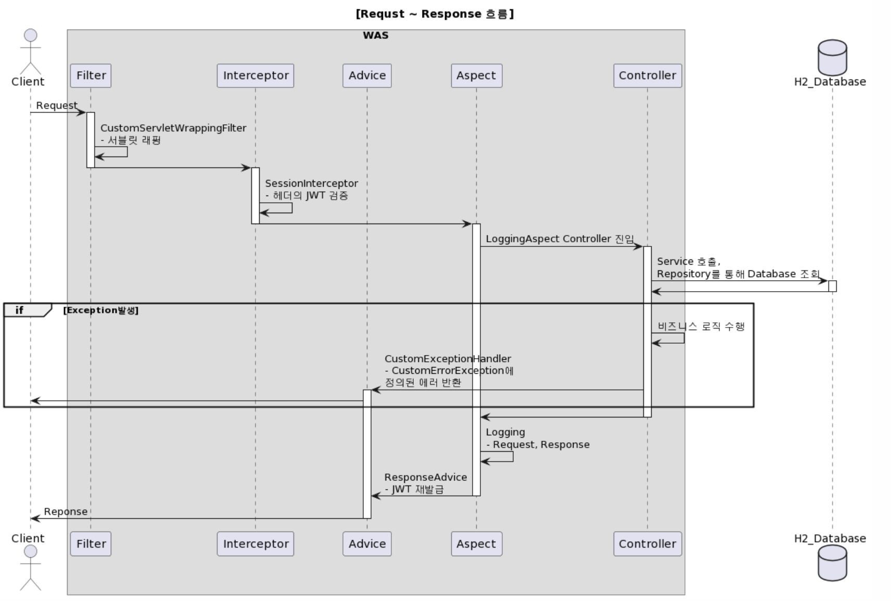
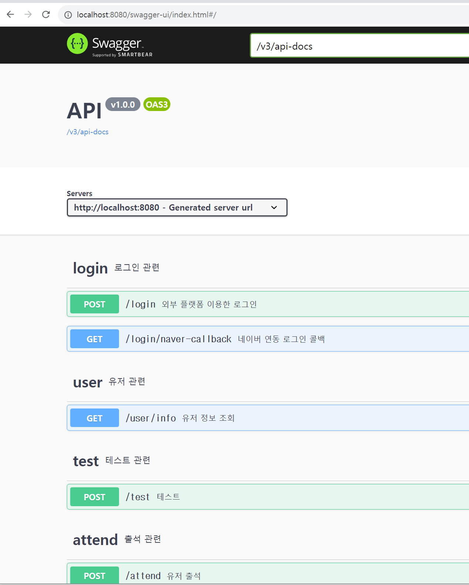
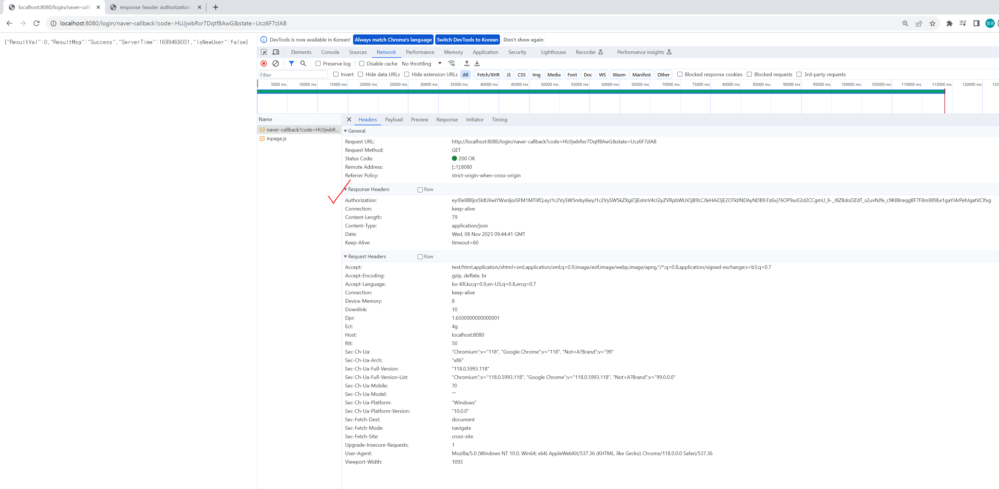
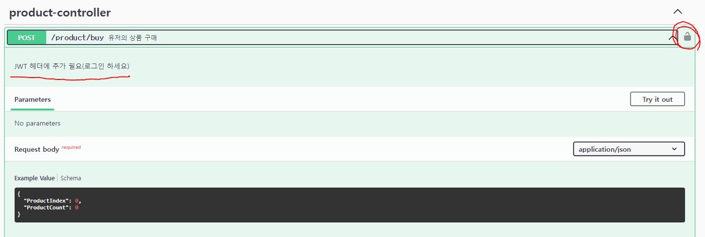
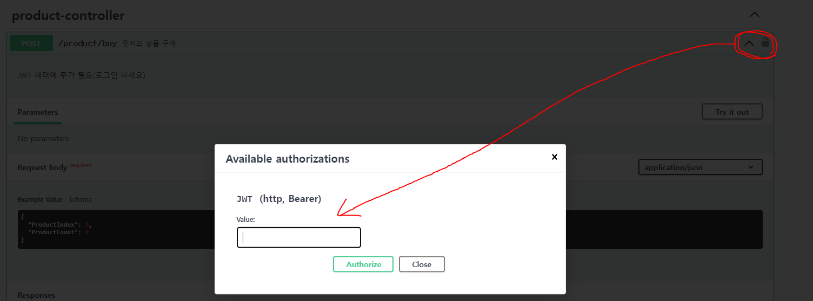
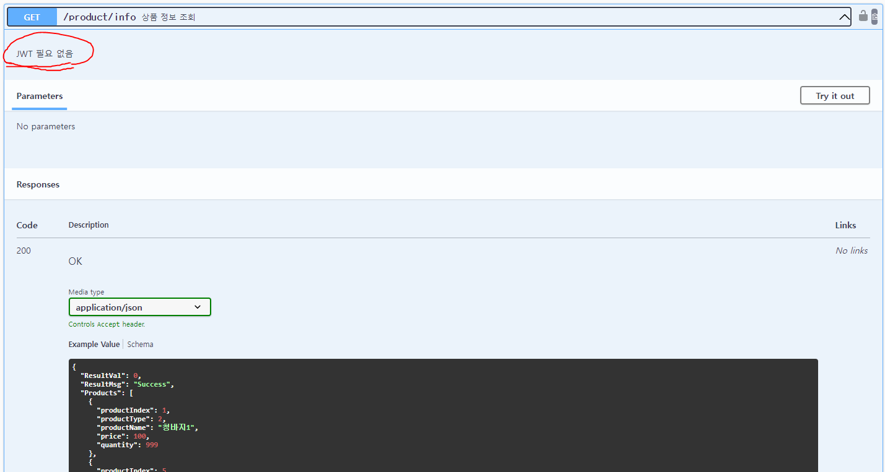
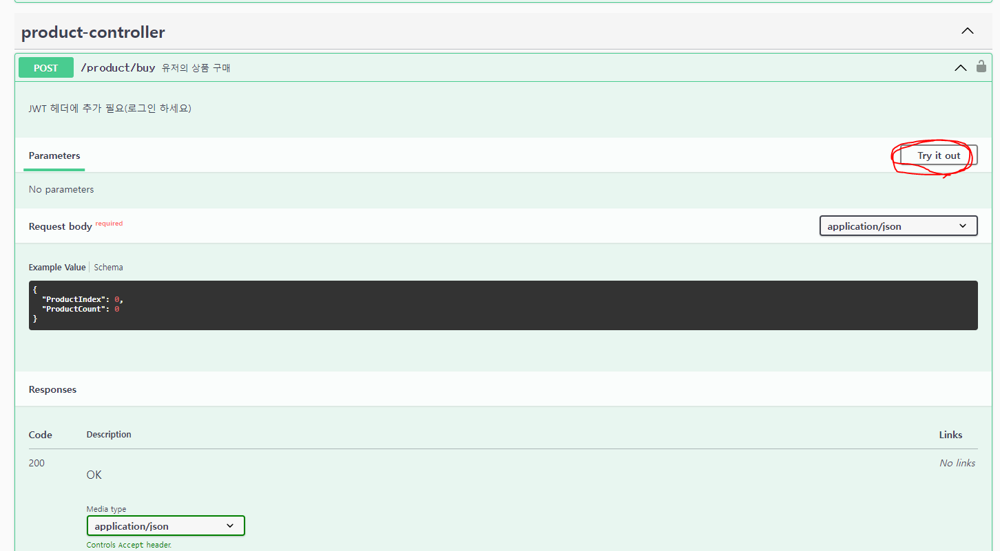
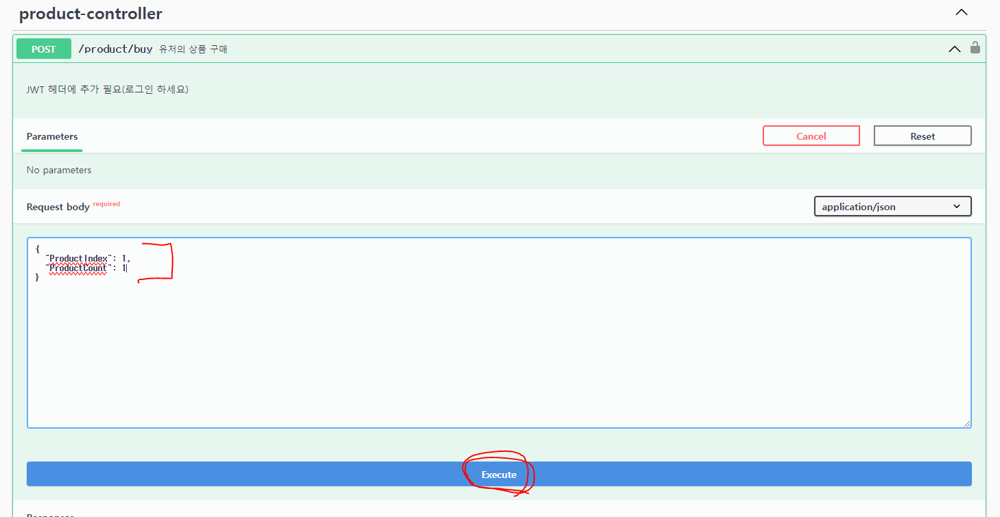

# JAVA-Spring-WEB

## 😃 프로젝트 소개
JAVA Spring기반 WAS 구현

## ✏ 프로젝트 목적
개발자 김범경의 코딩 스타일 예시

## 🕰 개발 기간
* 22.09.27일 ~ 진행중

## ⚙️ 개발 환경
- Java 17
- JDK 17
- IDE : IntelliJ
- Framework : Springboot(3.1.4)
- Database : H2(Docker 기반)
- ORM : JPA(Spring Data JPA, QueryDSL)

## 💾 데이터 베이스 관련
**`WAS를 실행시키기 위해 DB가 먼저 구축 되어야합니다.`  **
- 1. docker-compose 를 설치하여야 합니다.(추천 : 도커 데스크톱 설치)
- 2. cmd창을 열어서 docker-compose.yml 파일이 있는 위치로 이동 (cd명령어)
- 3. 해당 경로의 cmd창에서 하기의 명령어 입력
** `docker-compose up -d` **

## 📌 주요 기능
## Request ~ Response 간단 Flow

  

### API 명세서 (Swagger로 작성)
**`WAS를 실행시키고 주소창에 밑의 내용을 치면, Swagger UI를 확인할 수 있습니다.`  **
- http://localhost:8080/swagger-ui/index.html  

  

### 1. API 로깅
	- Request, Response 
	
### 2. 네이버 외부 API를 이용한 로그인
	- WAS 실행 후 밑의 내용 주소창에 localhost:8080 입력후, 로그인 버튼을 누른다.
		
### 3. 유저 관련 API
	- 유저 정보 조회 API : /users/info
		
### 4. 출석 관련 API
	- 출석 하기 API : /attend
	- 출석 정보 조회 API : /attend/info
	
### 5. 상품 관련 API
	- 상품 정보 조회 API : /product/info
	- 상품 정보 수정 API : /product/edit
	- 유저 상품 정보 조회 API : /product/user-info
	- 유저 상품 구매 API : /product/buy
	
## 📌 인지 사항
### 1. Request header에 Authorization 추가해야 합니다.
   `- JWT를 이용한 인증 체계입니다.` 
   `-  유저 정보 조회시 필요하고, 기획 데이터 정보 조회시 필요하지 않습니다. `
	
### 2. Authorizetion을 얻는 방법
	- localhost:8080 
	- F12 버튼을 누르고 로그인 버튼을 누르고 로그인한다.
	- 밑의 사진처럼 Authorizetion을 알아낸다.

  

### 3. Swagger를 이용하여 API Test시 Authorization 추가하는 방법
- **`밑의 사진처럼 JWT가 필요한 경우에(유저 정보 조회) 'JWT 헤더에 추가해주세요' 멘트가 있습니다` **
**`우측 상단 자물쇠 버튼을 클릭합니다`**  

  

- **`밑의 사진에서 Value의 값에 2번에서 얻은 Authorization을 추가합니다.`** 

  

- **`만약 JWT가 필요하지 않은 경우에(기획 정보 조회) 'JWT 필요 없음' 멘트가 있습니다.`** 

  

- **`요청 보낼 Request Body 형식을 확인하고 우측 상단의 'Try it out' 버튼을 누릅니다.`** 

  

- **`요청 보낼 Request Body를 성정하고 Execute 버튼을 눌러서 API 테스트를 실행합니다.`** 

  

### 4. (참고) Postman을 이용하여 요청시 Authorization 추가하는 방법

 

