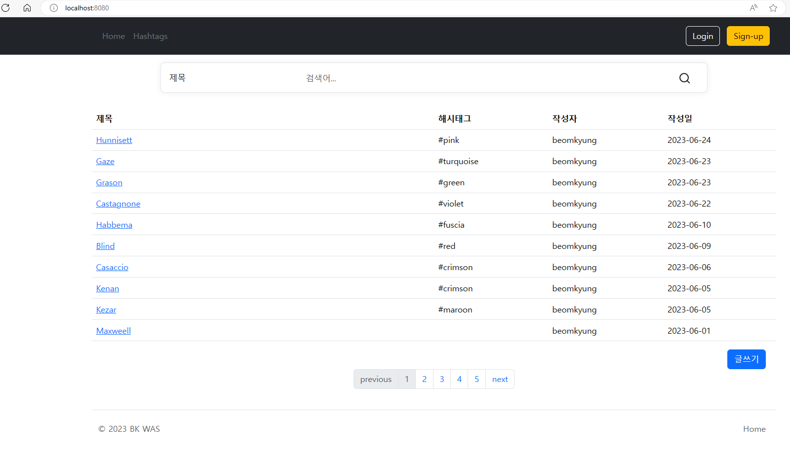
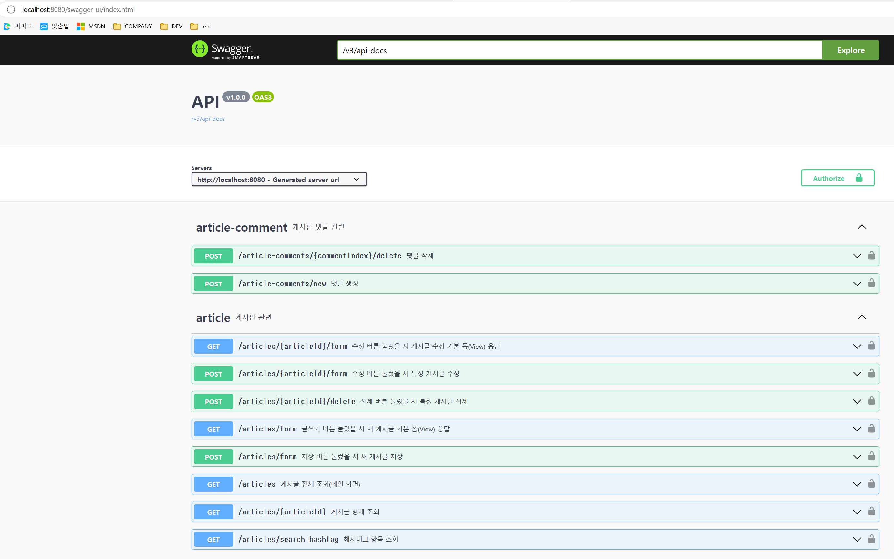

# JAVA-Spring-Article

## 😃 게시판 프로젝트 소개
JAVA Spring기반 WAS 구현

## ✏ 프로젝트 목적
- 개발자 김범경의 코딩 스타일 예시 
- 학습용

## 🕰 개발 기간
* 22.12.01일 ~ 진행중

## ⚙️ 개발 환경
- Java 17
- JDK 17
- IDE : IntelliJ
- Framework : Springboot(3.1.4)
- Database : Mysql(Docker 기반)
- ORM : JPA(Spring Data JPA, QueryDSL)
- Monitoring : Prometheus, Grafana

## 💾 데이터 베이스 관련(필수)
**`WAS를 실행시키기 위해 DB가 먼저 구축 되어야합니다.`  **
- 1. docker-compose 를 설치하여야 합니다.(추천 : 도커 데스크톱 설치)
- 2. cmd창을 열어서 docker-compose.yml 파일이 있는 위치로 이동 (web/db/docker-compose.yml)
- 3. 해당 경로의 cmd창에서 하기의 명령어 입력
** `docker-compose up -d` **

## 📌 주요 기능
**`Front Web Page가 구성되어 있습니다. `  **
**`WAS 동작 후 localhost:8080을 통해 확인하세요.`  **
**`WAS 동작 후 localhost:8080을 통해 확인하세요.`  **

### 1. 게시글 관련 API
	- 게시글 전체 조회(메인 화면) : /articles 
	- 게시글 상세 조회 : /articles/{articleId}
	- 해시태그 항목 조회 : /articles/search-hashtag
	- 새 게시글 기본 폼(View) 응답(글쓰기 버튼) : /articles/form
	- 새 게시글 저장(저장 버튼) : /articles/form
	- 특정 게시글 수정 기본 폼(View) 응답(수정 버튼) : /articles/{articleId}/form
	- 특정 게시글 수정(수정 버튼) : /articles/{articleId}/form
	- 특정 게시글 삭제(삭제 버튼) : /articles/{articleId}/delete
	
### 2. 게시글 댓글 관련 API
	- 댓글 생성 : /article-comments/new
	- 댓글 삭제 : /article-comments/{commentId}/delete
	
### 3. 인증(로그인 관련)	
	- 카카오톡 인증 로그인 : oAuth2UserService 로직 참고

	
## 📜 API 명세서 (Swagger로 작성)
**`WAS를 실행시키고 주소창에 밑의 내용을 치면, Swagger UI를 확인할 수 있습니다.`  **
- http://localhost:8080/swagger-ui/index.html  

  

## 👀 모니터링(프로메테우스, 그라파나)
- 1. docker-compose 를 설치하여야 합니다.(추천 : 도커 데스크톱 설치)
- 2. cmd창을 열어서 docker-compose.yml 파일이 있는 위치로 이동 (web/monitoring/docker-compose.yml)
- 3. 해당 경로의 cmd창에서 하기의 명령어 입력
** `docker-compose up -d` **